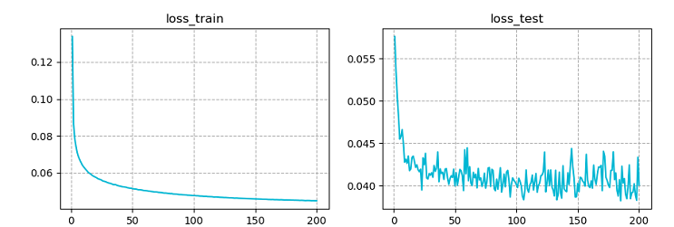
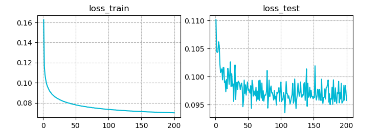

# 3d_pose_baseline_pytorch

A PyTorch implementation of a simple baseline for 3d human pose estimation.
You can check the origin Tensorflow implementation written by [Julieta Martinez et al.](https://github.com/una-dinosauria/3d-pose-baseline).
Some codes for data processing are brought from the origin version, thanks to the authors.

<!--  -->

This is the code for the paper

```
@inproceedings{martinez_2017_3dbaseline,
  title={A simple yet effective baseline for 3d human pose estimation},
  author={Martinez, Julieta and Hossain, Rayat and Romero, Javier and Little, James J.},
  booktitle={ICCV},
  year={2017}
}
```

## WIP


 - [x] Training code
 - [x] Testing code

### Datasets

 - [x] Human3.6M
 - [ ] HumanEva


## Dependencies

* [h5py](http://www.h5py.org/)
* [PyTorch](http://pytorch.org/) >= 3.0.0

## Installation

1. First, clone this repository:
    ```
    git clone --recursive https://github.com/weigq/3d_pose_baseline_pytorch.git
    ```
2. Download the pre-processed [Human3.6M](https://drive.google.com/file/d/11l53VgNPDxV5EZP-GhyGlMAX5pWsN7WH/view?usp=sharing) dataset in 3d joints:
    ```
    unzip human36m.zip
    rm h36m.zip
    ```

## Usage

### Data preprocess

### Train

1. Train on Human3.6M groundtruth 2d joints:
    ```
    # optional arguments, you can access more details in opt.py
    main.py [-h] [--data_dir DATA_DIR] [--exp EXP] [--ckpt CKPT]
               [--load LOAD] [--test] [--resume]
               [--action {all,All}]
               [--max_norm] [--linear_size LINEAR_SIZE]
               [--num_stage NUM_STAGE] [--use_hg] [--lr LR]
               [--lr_decay LR_DECAY] [--lr_gamma LR_GAMMA] [--epochs EPOCHS]
               [--dropout DROPOUT] [--train_batch TRAIN_BATCH]
               [--test_batch TEST_BATCH] [--job JOB] [--no_max] [--max]
               [--procrustes]
    ```
    train the model:
    ```
    python main.py --exp example
    ```

    You will get the training and testing loss curves like:

    

2. ~~Train on Human3.6M 2d joints detected by stacked hourglass:~~
    <!-- ``` -->

    <!-- ``` -->

    <!-- You will get the training and testing loss curves like: -->

    <!--  -->

### Test

1. You can download the [pretrianed model](https://drive.google.com/file/d/1NUY8oZoLKY9DP63Jg_ZE96_DEJKiVvRp/view?usp=sharing) on ground-truth 2d pose for quick demo.

    ```
    python main.py --load $PATH_TO_gt_ckpt_best.pth.tar --test
    ```
    and you will get the results:

    |  | direct. | discuss. | eat. | greet. | phone | photo | pose | purch. | sit | sitd. | somke | wait | walkd. | walk | walkT | avg |
    | :--: | :--: | :--: | :--: | :--: |  :--: | :--: | :--: | :--: | :--: | :--: | :--: | :--: | :--: | :--: | :--: | :--: |
    | original version | 37.7 | 44.4 | 40.3 | 42.1 | 48.2 | 54.9 | 44.4 | 42.1 | 54.6 | 58.0 | 45.1 | 46.4 | 47.6 | 36.4 | 40.4 | 45.5|
    | pytorch version | 35.7 | 42.3 | 39.4 | 40.7 | 44.5 | 53.3 | 42.8 | 40.1 | 52.5 | 53.9 | 42.8 | 43.1 | 44.1 | 33.4 | 36.3 | 43.5 |

## License
MIT
